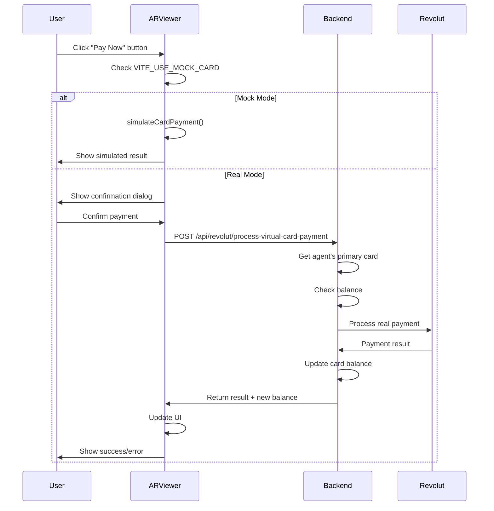
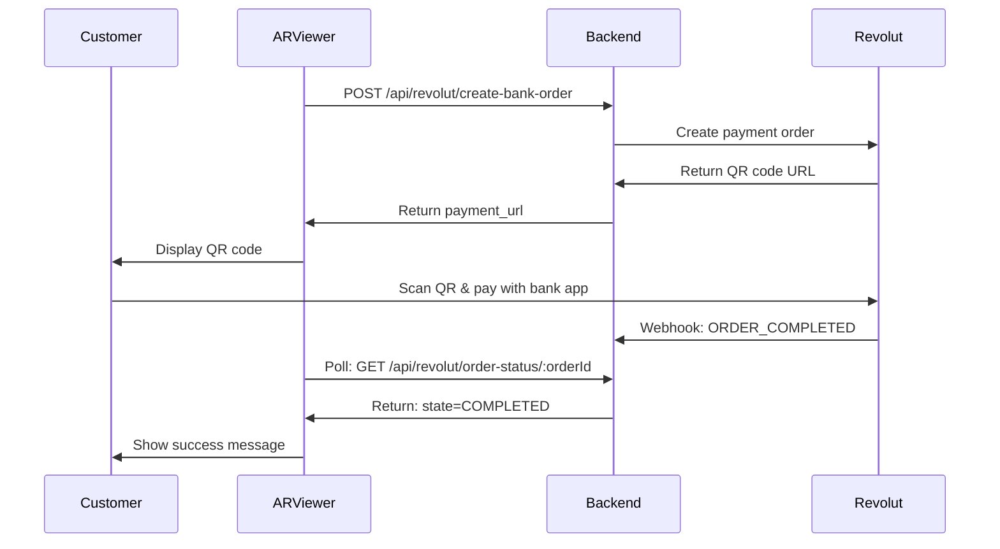

# AR Viewer Real Transactions Integration Prompt

**Date**: October 20, 2025  
**Target**: AR Viewer Copilot  
**Backend**: AgentSphere Revolut Integration (revolut-pay branch)  
**Objective**: Enable REAL transactions for both Virtual Cards and Bank QR payments

---

## 🎯 Integration Goal

Transform the AR Viewer from simulation-only to support **real Revolut transactions** for:

1. **Virtual Card Payments** - Real charges using agent's virtual card
2. **Bank QR Payments** - Real customer payments via bank transfer

---

## 📋 Current State Analysis

### **Virtual Card Payment** 🔵 Currently: SIMULATED ONLY

**Mock Mode** (`VITE_USE_MOCK_CARD=true`):

- ✅ Pure simulation - No real transaction
- ✅ 2-second delay for realism
- ✅ Deducts amount from card balance locally
- ✅ Creates mock transaction record
- ✅ Button labeled: "🧪 Make Test Payment"
- ✅ No actual money movement

**Real Mode** (`VITE_USE_MOCK_CARD=false`):

- ✅ Still simulation - Calls `/api/revolut/test-card-payment`
- ✅ NOT a real charge - Just tests the card
- ✅ Backend simulates the transaction
- ✅ No actual money is charged
- ✅ Used for testing card functionality

**Problem**: Even in "real mode", Virtual Card payments are still simulated!

### **Bank QR Payment** 🟢 Currently: CAN BE REAL

**Mock Mode** (`VITE_USE_MOCK_BANK=true`):

- ✅ Simulated - No real transaction
- ✅ 1.5-second delay for realism
- ✅ Returns fake completion status
- ✅ Button labeled: "💳 Pay Now (Mock)"
- ✅ Testing indicator: "🎭 Testing mode"

**Real Mode** (`VITE_USE_MOCK_BANK=false`):

- ⚠️ CAN be real - Opens actual Revolut payment page
- ⚠️ User completes real payment on Revolut website
- ⚠️ Real money transfer occurs
- ⚠️ Webhook notifies backend of completion
- ⚠️ Status polling detects payment

**Status**: Bank QR already supports real transactions! ✅

---

## 🔧 Required Changes

### **Change 1: Enable Real Virtual Card Payments**

**Backend Endpoint Available**:

```
POST /api/revolut/process-virtual-card-payment
```

**What It Does**:

- Charges agent's virtual card with real money
- Deducts from card balance
- Creates real transaction record
- Returns updated balance and transaction details

**AR Viewer Changes Needed**:

1. **Update `simulateCardPayment()` function** to call real endpoint when `VITE_USE_MOCK_CARD=false`

2. **Add new function `processRealCardPayment()`**:

```javascript
async function processRealCardPayment(agentId, amount, currency, orderId) {
  try {
    const response = await fetch(
      `${
        import.meta.env.VITE_API_URL
      }/api/revolut/process-virtual-card-payment`,
      {
        method: "POST",
        headers: {
          "Content-Type": "application/json",
        },
        body: JSON.stringify({
          agentId: agentId,
          orderId: orderId,
          amount: amount,
          currency: currency,
        }),
      }
    );

    const result = await response.json();

    if (!response.ok) {
      throw new Error(result.error || "Payment failed");
    }

    return {
      success: true,
      order_id: result.order_id,
      amount: result.amount,
      currency: result.currency,
      remaining_balance: result.remaining_balance,
      transaction_id: result.transaction_id,
      timestamp: new Date().toISOString(),
    };
  } catch (error) {
    console.error("Real card payment failed:", error);
    return {
      success: false,
      error: error.message,
    };
  }
}
```

3. **Modify the payment button logic**:

```javascript
async function handleCardPayment() {
  const useMock = import.meta.env.VITE_USE_MOCK_CARD === "true";

  if (useMock) {
    // Existing mock simulation
    const result = await simulateCardPayment(agentId, amount, currency);
  } else {
    // NEW: Real card payment
    const result = await processRealCardPayment(
      agentId,
      amount,
      currency,
      orderId
    );

    if (result.success) {
      // Update UI with real transaction
      console.log("✅ Real payment processed:", result.transaction_id);
      console.log(
        "💰 Remaining balance:",
        result.remaining_balance,
        result.currency
      );

      // Refresh card balance from backend
      await fetchAgentCard();
    } else {
      // Show error to user
      alert(`Payment failed: ${result.error}`);
    }
  }
}
```

4. **Update button label**:

```javascript
const buttonLabel = useMock
  ? "🧪 Make Test Payment"
  : "💳 Pay Now (Real Transaction)";
```

5. **Add balance refresh after real payment**:

```javascript
async function fetchAgentCard() {
  const response = await fetch(
    `${
      import.meta.env.VITE_API_URL
    }/api/revolut/virtual-card/agent/${agentId}/primary`
  );
  const data = await response.json();

  if (data.card) {
    // Update UI with latest balance
    setCardBalance(data.card.balance);
    setCardCurrency(data.card.currency);
  }
}
```

---

## 🎨 UI/UX Improvements

### **1. Clear Mode Indicators**

**Mock Mode**:

```javascript
<div className="mode-indicator mock">🎭 Testing Mode - No real money</div>
```

**Real Mode**:

```javascript
<div className="mode-indicator real">
  ⚠️ REAL TRANSACTIONS - Real money will be charged
</div>
```

### **2. Payment Confirmation Dialog**

Before real Virtual Card payment:

```javascript
const confirmPayment = () => {
  const confirmed = window.confirm(
    `⚠️ REAL PAYMENT CONFIRMATION\n\n` +
      `Amount: ${amount} ${currency}\n` +
      `Card Balance: ${cardBalance} ${cardCurrency}\n` +
      `Remaining After: ${cardBalance - amount} ${cardCurrency}\n\n` +
      `This will charge your virtual card with REAL MONEY.\n\n` +
      `Continue?`
  );

  if (confirmed) {
    handleCardPayment();
  }
};
```

### **3. Error Handling for Real Payments**

```javascript
// Insufficient balance
if (result.error?.includes("Insufficient balance")) {
  alert(
    `❌ Insufficient Balance\n\n` +
      `Card Balance: ${cardBalance} ${currency}\n` +
      `Payment Amount: ${amount} ${currency}\n\n` +
      `Please top up your card first.`
  );
  // Show "Top Up Card" button
  setShowTopUpModal(true);
}

// Card not found
if (result.error?.includes("No virtual card found")) {
  alert(
    `❌ No Virtual Card\n\n` +
      `You need to create a virtual card first.\n\n` +
      `Would you like to create one now?`
  );
  // Show "Create Card" flow
  setShowCreateCardModal(true);
}

// Generic error
if (result.error) {
  alert(`❌ Payment Failed\n\n${result.error}`);
}
```

### **4. Success Feedback**

```javascript
if (result.success) {
  // Show success message
  showToast(
    "✅ Payment Successful",
    `Charged: ${result.amount} ${result.currency}\n` +
      `New Balance: ${result.remaining_balance} ${result.currency}`,
    "success"
  );

  // Update UI
  setLastTransaction({
    id: result.transaction_id,
    amount: result.amount,
    currency: result.currency,
    timestamp: result.timestamp,
  });

  // Refresh card data
  await fetchAgentCard();
}
```

---

## 📊 Complete Integration Flow

### **Virtual Card Real Payment Flow**



### **Bank QR Real Payment Flow** (Already Working ✅)



---

## 🔒 Security Considerations

### **1. Environment Variables**

Update `.env` or `.env.production`:

```bash
# AR Viewer Environment Variables
VITE_API_URL=http://localhost:3001
VITE_USE_MOCK_CARD=false
VITE_USE_MOCK_BANK=false

# Backend Environment Variables
REVOLUT_ACCESS_TOKEN=your_real_production_token
REVOLUT_API_BASE_URL=https://merchant.revolut.com
```

### **2. User Confirmation**

Always show confirmation for real payments:

```javascript
const requireConfirmation = import.meta.env.VITE_USE_MOCK_CARD === "false";

if (requireConfirmation) {
  const confirmed = await showPaymentConfirmation();
  if (!confirmed) return;
}
```

### **3. Balance Validation**

Check balance client-side before attempting payment:

```javascript
if (amount > cardBalance) {
  alert("Insufficient balance. Please top up your card.");
  return;
}
```

### **4. Error Recovery**

Provide clear recovery paths:

- Insufficient balance → Show "Top Up" button
- No card → Show "Create Card" button
- Network error → Show "Retry" button
- Invalid amount → Show error message

---

## 🧪 Testing Strategy

### **Phase 1: Mock Mode Testing** (No Risk)

```bash
# .env.local
VITE_USE_MOCK_CARD=true
VITE_USE_MOCK_BANK=true
```

1. Test Virtual Card payment simulation
2. Test Bank QR payment simulation
3. Verify UI updates correctly
4. Test error handling
5. Test confirmation dialogs

**Expected**: No real money, all simulated ✅

### **Phase 2: Sandbox Testing** (Safe)

```bash
# .env.local
VITE_USE_MOCK_CARD=false
VITE_USE_MOCK_BANK=false
VITE_API_URL=http://localhost:3001
```

```bash
# Backend .env
REVOLUT_ACCESS_TOKEN=sandbox_token
REVOLUT_API_BASE_URL=https://sandbox-merchant.revolut.com
```

1. Create test virtual card with $100
2. Test real Virtual Card payment (uses sandbox money)
3. Verify balance deduction
4. Test Bank QR payment (sandbox)
5. Verify webhook delivery
6. Test error scenarios

**Expected**: Uses Revolut Sandbox (fake money, real API) ✅

### **Phase 3: Production Testing** (Real Money!)

```bash
# .env.production
VITE_USE_MOCK_CARD=false
VITE_USE_MOCK_BANK=false
VITE_API_URL=https://your-production-api.com
```

```bash
# Backend .env
REVOLUT_ACCESS_TOKEN=production_token
REVOLUT_API_BASE_URL=https://merchant.revolut.com
```

1. Start with small amounts ($1-5)
2. Test Virtual Card payment with real card
3. Test Bank QR payment with real bank account
4. Monitor Revolut dashboard
5. Verify webhooks in production
6. Test refund/reversal if needed

**Expected**: REAL MONEY transactions ⚠️

---

## 📝 Implementation Checklist

### **Backend** (Already Done ✅)

- [x] Virtual Card creation endpoint
- [x] Get primary card endpoint
- [x] Top up card endpoint
- [x] Process card payment endpoint
- [x] Bank QR creation endpoint
- [x] Order status endpoint
- [x] Webhook handler
- [x] Mock mode support
- [x] Single-card-per-agent model
- [x] Error handling
- [x] Security (CORS, auth)

### **AR Viewer** (To Do 📋)

- [ ] Add `processRealCardPayment()` function
- [ ] Update `simulateCardPayment()` to route based on mode
- [ ] Add confirmation dialog for real payments
- [ ] Update button labels based on mode
- [ ] Add mode indicators (Mock vs Real)
- [ ] Implement balance refresh after payment
- [ ] Add error handling for real payment failures
- [ ] Add success/error toast notifications
- [ ] Update UI to show transaction history
- [ ] Test with mock mode (Phase 1)
- [ ] Test with sandbox mode (Phase 2)
- [ ] Deploy to production (Phase 3)

---

## 🚀 Step-by-Step Implementation Guide

### **Step 1: Add Real Payment Function** (15 minutes)

Create new file: `src/services/revolutPayment.js`

```javascript
// AR Viewer: src/services/revolutPayment.js

const API_URL = import.meta.env.VITE_API_URL || "http://localhost:3001";
const USE_MOCK_CARD = import.meta.env.VITE_USE_MOCK_CARD === "true";

/**
 * Process real Virtual Card payment
 */
export async function processRealCardPayment({
  agentId,
  amount,
  currency,
  orderId,
}) {
  try {
    const response = await fetch(
      `${API_URL}/api/revolut/process-virtual-card-payment`,
      {
        method: "POST",
        headers: {
          "Content-Type": "application/json",
        },
        body: JSON.stringify({
          agentId,
          orderId,
          amount,
          currency,
        }),
      }
    );

    const result = await response.json();

    if (!response.ok) {
      throw new Error(result.error || "Payment failed");
    }

    return {
      success: true,
      order_id: result.order_id,
      amount: result.amount,
      currency: result.currency,
      remaining_balance: result.remaining_balance,
      transaction_id: result.transaction_id,
      timestamp: new Date().toISOString(),
    };
  } catch (error) {
    console.error("Real card payment failed:", error);
    return {
      success: false,
      error: error.message,
    };
  }
}

/**
 * Get agent's primary virtual card
 */
export async function getAgentCard(agentId) {
  try {
    const endpoint = USE_MOCK_CARD
      ? `${API_URL}/api/revolut/mock/virtual-card/agent/${agentId}/primary`
      : `${API_URL}/api/revolut/virtual-card/agent/${agentId}/primary`;

    const response = await fetch(endpoint);
    const data = await response.json();

    return data.card;
  } catch (error) {
    console.error("Failed to fetch card:", error);
    return null;
  }
}

/**
 * Simulate card payment (for testing)
 */
export async function simulateCardPayment({ agentId, amount, currency }) {
  // Simulate delay
  await new Promise((resolve) => setTimeout(resolve, 2000));

  return {
    success: true,
    order_id: `mock_order_${Date.now()}`,
    amount,
    currency,
    remaining_balance: 100 - amount, // Mock balance
    transaction_id: `mock_tx_${Date.now()}`,
    timestamp: new Date().toISOString(),
  };
}
```

### **Step 2: Update Payment Component** (20 minutes)

Modify your Virtual Card payment component:

```javascript
// AR Viewer: src/components/VirtualCardPayment.jsx

import { useState, useEffect } from "react";
import {
  processRealCardPayment,
  simulateCardPayment,
  getAgentCard,
} from "../services/revolutPayment";

export function VirtualCardPayment({ agentId, amount, currency }) {
  const [card, setCard] = useState(null);
  const [loading, setLoading] = useState(false);
  const [lastTransaction, setLastTransaction] = useState(null);

  const useMock = import.meta.env.VITE_USE_MOCK_CARD === "true";

  // Fetch card on mount
  useEffect(() => {
    fetchCard();
  }, [agentId]);

  async function fetchCard() {
    const cardData = await getAgentCard(agentId);
    setCard(cardData);
  }

  async function handlePayment() {
    // Pre-flight checks
    if (!card) {
      alert("❌ No virtual card found. Please create one first.");
      return;
    }

    if (amount > card.balance) {
      alert(
        `❌ Insufficient Balance\n\n` +
          `Card Balance: ${card.balance} ${card.currency}\n` +
          `Payment Amount: ${amount} ${currency}\n\n` +
          `Please top up your card first.`
      );
      return;
    }

    // Confirmation for real payments
    if (!useMock) {
      const confirmed = window.confirm(
        `⚠️ REAL PAYMENT CONFIRMATION\n\n` +
          `Amount: ${amount} ${currency}\n` +
          `Card Balance: ${card.balance} ${card.currency}\n` +
          `Remaining After: ${card.balance - amount} ${card.currency}\n\n` +
          `This will charge your virtual card with REAL MONEY.\n\n` +
          `Continue?`
      );

      if (!confirmed) return;
    }

    setLoading(true);

    try {
      const result = useMock
        ? await simulateCardPayment({ agentId, amount, currency })
        : await processRealCardPayment({
            agentId,
            amount,
            currency,
            orderId: `order_${Date.now()}`,
          });

      if (result.success) {
        // Success!
        alert(
          `✅ Payment Successful\n\n` +
            `Amount: ${result.amount} ${result.currency}\n` +
            `New Balance: ${result.remaining_balance} ${result.currency}\n` +
            `Transaction ID: ${result.transaction_id}`
        );

        setLastTransaction(result);

        // Refresh card balance
        await fetchCard();
      } else {
        // Error
        alert(`❌ Payment Failed\n\n${result.error}`);
      }
    } catch (error) {
      alert(`❌ Payment Error\n\n${error.message}`);
    } finally {
      setLoading(false);
    }
  }

  return (
    <div className="virtual-card-payment">
      {/* Mode Indicator */}
      <div className={`mode-indicator ${useMock ? "mock" : "real"}`}>
        {useMock ? "🎭 Testing Mode - No real money" : "⚠️ REAL TRANSACTIONS"}
      </div>

      {/* Card Info */}
      {card ? (
        <div className="card-info">
          <h3>Virtual Card</h3>
          <p>
            Balance: {card.balance} {card.currency}
          </p>
          <p>Card: •••• {card.card_number.slice(-4)}</p>
        </div>
      ) : (
        <div className="no-card">
          <p>No virtual card found</p>
          <button
            onClick={() => {
              /* Show create card modal */
            }}
          >
            Create Virtual Card
          </button>
        </div>
      )}

      {/* Payment Button */}
      <button
        onClick={handlePayment}
        disabled={loading || !card}
        className={useMock ? "btn-test" : "btn-real"}
      >
        {loading
          ? "⏳ Processing..."
          : useMock
          ? "🧪 Make Test Payment"
          : "💳 Pay Now (Real Transaction)"}
      </button>

      {/* Last Transaction */}
      {lastTransaction && (
        <div className="last-transaction">
          <h4>Last Transaction</h4>
          <p>ID: {lastTransaction.transaction_id}</p>
          <p>
            Amount: {lastTransaction.amount} {lastTransaction.currency}
          </p>
          <p>Time: {new Date(lastTransaction.timestamp).toLocaleString()}</p>
        </div>
      )}
    </div>
  );
}
```

### **Step 3: Add Environment Variables** (5 minutes)

Create `.env.local`:

```bash
# AR Viewer Environment
VITE_API_URL=http://localhost:3001
VITE_USE_MOCK_CARD=true
VITE_USE_MOCK_BANK=true
```

Create `.env.production`:

```bash
# AR Viewer Production
VITE_API_URL=https://your-production-api.com
VITE_USE_MOCK_CARD=false
VITE_USE_MOCK_BANK=false
```

### **Step 4: Add CSS Styling** (10 minutes)

```css
/* AR Viewer: src/styles/payment.css */

.mode-indicator {
  padding: 8px 16px;
  border-radius: 4px;
  margin-bottom: 16px;
  font-weight: bold;
  text-align: center;
}

.mode-indicator.mock {
  background-color: #e3f2fd;
  color: #1976d2;
  border: 2px solid #1976d2;
}

.mode-indicator.real {
  background-color: #fff3e0;
  color: #e65100;
  border: 2px solid #e65100;
}

.btn-test {
  background-color: #2196f3;
  color: white;
  padding: 12px 24px;
  border: none;
  border-radius: 4px;
  cursor: pointer;
  font-size: 16px;
}

.btn-real {
  background-color: #ff5722;
  color: white;
  padding: 12px 24px;
  border: none;
  border-radius: 4px;
  cursor: pointer;
  font-size: 16px;
  font-weight: bold;
}

.btn-test:hover {
  background-color: #1976d2;
}

.btn-real:hover {
  background-color: #e64a19;
}

.btn-test:disabled,
.btn-real:disabled {
  background-color: #ccc;
  cursor: not-allowed;
}

.card-info {
  background-color: #f5f5f5;
  padding: 16px;
  border-radius: 8px;
  margin-bottom: 16px;
}

.last-transaction {
  margin-top: 16px;
  padding: 12px;
  background-color: #e8f5e9;
  border-left: 4px solid #4caf50;
}
```

### **Step 5: Test Implementation** (30 minutes)

```bash
# 1. Start backend
cd agentsphere-backend
node server.js

# 2. Start AR Viewer with mock mode
cd ar-viewer
VITE_USE_MOCK_CARD=true npm run dev

# 3. Test mock payment
# - Click "Make Test Payment"
# - Should see 2-second delay
# - Should show success message
# - Balance should update

# 4. Switch to real mode (sandbox)
VITE_USE_MOCK_CARD=false npm run dev

# 5. Test real payment
# - Click "Pay Now (Real Transaction)"
# - Should see confirmation dialog
# - Confirm payment
# - Should charge actual card (sandbox)
# - Balance should update from backend
```

---

## 🎯 Success Criteria

### **Virtual Card Real Payments Working When:**

✅ Mock mode still works as before (no regression)  
✅ Real mode charges actual virtual card via Revolut API  
✅ Balance updates correctly after payment  
✅ User sees confirmation dialog before real payment  
✅ Error handling works (insufficient balance, no card, etc.)  
✅ UI clearly indicates mock vs real mode  
✅ Transaction history shows recent payments  
✅ Card refresh button updates balance from backend

### **Bank QR Real Payments Working When:**

✅ Already works! Just keep existing implementation  
✅ Real mode opens Revolut payment page  
✅ Polling detects payment completion  
✅ Webhook notifies backend (optional)  
✅ UI updates when payment completes

---

## 📞 Support & Troubleshooting

### **Common Issues**

**Issue**: "No virtual card found"

- **Solution**: Create card first using `/api/revolut/create-virtual-card`
- **AR Viewer**: Show "Create Card" button/modal

**Issue**: "Insufficient balance"

- **Solution**: Top up card using `/api/revolut/virtual-card/:cardId/topup`
- **AR Viewer**: Show "Top Up" button/modal

**Issue**: "Payment failed"

- **Check**: Backend logs for detailed error
- **Check**: Card state (must be ACTIVE, not FROZEN)
- **Check**: Network connectivity
- **Check**: Revolut API status

**Issue**: Balance not updating

- **Solution**: Call `getAgentCard()` after payment to refresh
- **Check**: Backend endpoint returning correct balance

---

## 🏁 Final Notes

### **What You're Changing**

1. Virtual Card payments go from **SIMULATED** → **REAL**
2. Bank QR payments **already real**, no changes needed
3. Clear UI indicators for mock vs real mode
4. User confirmation for real payments
5. Proper error handling and recovery

### **What Stays The Same**

✅ Backend API (already production-ready)  
✅ Bank QR payment flow (already works)  
✅ Mock mode functionality (for testing)  
✅ Card creation/management  
✅ Security and authentication

### **Next Steps After Integration**

1. Test thoroughly in mock mode
2. Test in Revolut Sandbox
3. Deploy to staging environment
4. Test with small real amounts
5. Deploy to production
6. Monitor transactions closely
7. Add analytics/logging
8. Iterate based on user feedback

---

## ✅ Quick Start Command

```bash
# For AR Viewer Copilot:
# "Implement real Virtual Card payments using the backend endpoint
# /api/revolut/process-virtual-card-payment. Currently, Virtual Card
# payments are always simulated. Update the payment flow to charge
# real money when VITE_USE_MOCK_CARD=false, similar to how Bank QR
# payments already work. Add confirmation dialogs, balance refresh,
# and clear mode indicators. Follow the implementation guide in
# AR_VIEWER_REAL_TRANSACTIONS_INTEGRATION_PROMPT.md."
```

---

**Integration Time Estimate**: 2-3 hours  
**Testing Time**: 1-2 hours  
**Total**: 3-5 hours to production-ready real payments! 🚀
